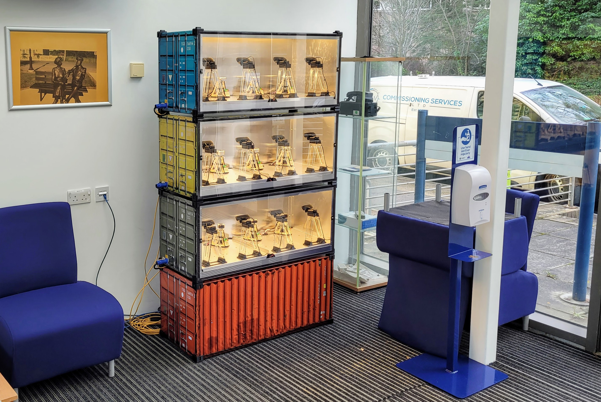

# Relay

![alt text][logo]

![alt text][status]
![alt text][coverage]

Relay is a set of tools and services to let you to host remote lab experiments, without opening firewall ports.

 - Secure websocket relay and host adapter for sharing video and data, with read/write permissions
 - Secure login shell relay, host adapter and client for end-to-end encrypted admin access without a jumpserver 
 - Booking server for connecting users to experiments
 - Works with experiments behind firewalls and NAT because all communications are relayed 
 - No need to open firewall ports, or get public IPv4 addresses.
 
## Background
 
Relay is the new core of the [practable.io](https://practable.io) remote laboratory ecosystem. Some of the educational thinking behind this ecosystem can be found [here](https://www.tandfonline.com/doi/full/10.1080/23752696.2020.1816845). If you cannot access the full-text of this paper (although please try, to show support for this idea), you can find an unformatted author final version in this repo at `docs/education`
  
To cite the paper:
>Timothy D. Drysdale (corresponding author), Simon Kelley, Anne-Marie Scott, Victoria Dishon, Andrew Weightman, Richard James Lewis & Stephen Watts (2020) Opinion piece: non-traditional practical work for traditional campuses, Higher Education Pedagogies, 5:1, 210-222, DOI: 10.1080/23752696.2020.1816845 

## Status

The system is currently suitable for single-tenacy operations, with a single administrative "zone". Additional automation of experiment and system provision has been developed and will be released once secret-handling has been separated out.

We've successfully used this code to run assessed coursework for over 250 students during Q1/Q2 of 2021, alongside some student recruitment events.

David P. Reid, Joshua Burridge, David B. Lowe, and Timothy D. Drysdale (corresponding author), Open-source remote laboratory experiments for controls engineering education, International Journal of Mechanical Engineering Education, Accepted 22 Jan 2022. 

 >  We describe and evaluate the use of a remote laboratory with approximately 250 third-year students in the ‘Controls and Instrumentation Engineering 3’ course in the School of Engineering at the University of Edinburgh. The remote laboratory was created using the first iteration of a new open-source infrastructure. A key component of the implementation is a secure video and data relay that permits experiments to be hosted on restricted networks and accessed from a wide range of browsers, so as to minimise the technical support burden on course staff. A heterogeneous set of twelve spinning disks driven by DC motors were provided to students via an online catalogue permitting instant and exclusive access to an individual experiment for up to 90 minutes a session. The student experience was evaluated via a survey, which comprised both qualitative and quantitative questions. Survey participation was optional and included some in-depth questions targeting the students’ experience from a UX perspective. The link between quantitative and qualitative results allows us to draw useful conclusions about the experiences of the students participating in the survey. Our main findings are that the overall experience was positive for the survey respondents, and that they perceive a distinction between having control over the equipment and control over the task. Our work indicates there is a need to better understand the implications of students making this distinction, and the effect it will have on future designs of remote laboratory tasks, user interfaces, and evaluations.

We've got over 50 experiments under management at the present time - with some of our latest in our new 1:6 scale ISO containers:

[status]: https://img.shields.io/badge/status-operating-green "status; development"
[coverage]: https://img.shields.io/badge/coverage-44%25-orange "Test coverage 44%"
[logo]: ./assets/images/logo.png "Relay ecosystem logo - hexagons connected in a network to a letter R"

