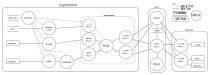

# Relay

![alt text][logo]

![alt text][status]
![alt text][coverage]

Relay is a set of tools and services to let you to host remote lab experiments, without opening firewall ports.

 - Secure websocket relay and host adapter for sharing video and data, with read/write permissions
 - Secure login shell relay, host adapter and client for end-to-end encrypted admin access without a jumpserver 
 - Booking server for connecting users to experiments
 - Works with experiments behind firewalls and NAT because all communications are relayed 
 - No need to open firewall ports, or get public IPv4 addresses.
 
## Background
 
Relay is the new core of the [practable.io](https://practable.io) remote laboratory ecosystem. Some of the educational thinking behind this ecosystem can be found [here](https://www.tandfonline.com/doi/full/10.1080/23752696.2020.1816845) [1]. 
  
## Status

The system is currently suitable for single-tenacy operations, with a single administrative "zone". Additional automation of experiment and system provision has been developed and will be released once secret-handling has been separated out.

We've successfully used this code to run assessed coursework for over 250 students during Q1/Q2 of 2021, alongside some student recruitment events [2].

We've got over 50 experiments under management at the present time - with some of our latest in our new 1:6 scale ISO containers:

## Overview

This repo contains a system for running experiments behind firewalls, including 

0. `session host` runs on the experiment to connect to the `session relay` to stream data and receive commands
0. `session relay` runs in the cloud to connect experiments and users.
0. `book serve` runs in the cloud (to handle bookings)
0. `shell host` runs on the experiment to connect to the `shell relay` to provide secured `ssh` connections to the experiment
0. `shell relay` runs in the cloud (to connect experiments and administrators)
0. `shell client` runs on the administrators' systems to connect to the `shell relay` 

<figure>

<figcaption align = "center"><b>Dataflow diagram of the `session host` to `session relay` connection, reproduced from [2] under CC-BY-4.0 license</b></figcaption>
</figure>

### More information

Additonal documentation (in various states of completeness) can be found on the following components here:

0. [booking](./internal/booking/README.md)
0. [booking client](./internal/bc/README.md)
0. [session](./cmd/session/README.md)
0. [shell relay](./internal/shellrelay/README.md)
0. [shell host](./internal/shellhost/README.md)

## References

[1] Timothy D. Drysdale (corresponding author), Simon Kelley, Anne-Marie Scott, Victoria Dishon, Andrew Weightman, Richard James Lewis & Stephen Watts (2020) Opinion piece: non-traditional practical work for traditional campuses, Higher Education Pedagogies, 5:1, 210-222, DOI: 10.1080/23752696.2020.1816845 

[2] David P. Reid, Joshua Burridge, David B. Lowe, and Timothy D. Drysdale (corresponding author), Open-source remote laboratory experiments for controls engineering education, International Journal of Mechanical Engineering Education, Accepted 22 Jan 2022. 

[status]: https://img.shields.io/badge/status-operating-green "status; development"
[coverage]: https://img.shields.io/badge/coverage-44%25-orange "Test coverage 44%"
[logo]: ./img/logo.png "Relay ecosystem logo - hexagons connected in a network to a letter R"

