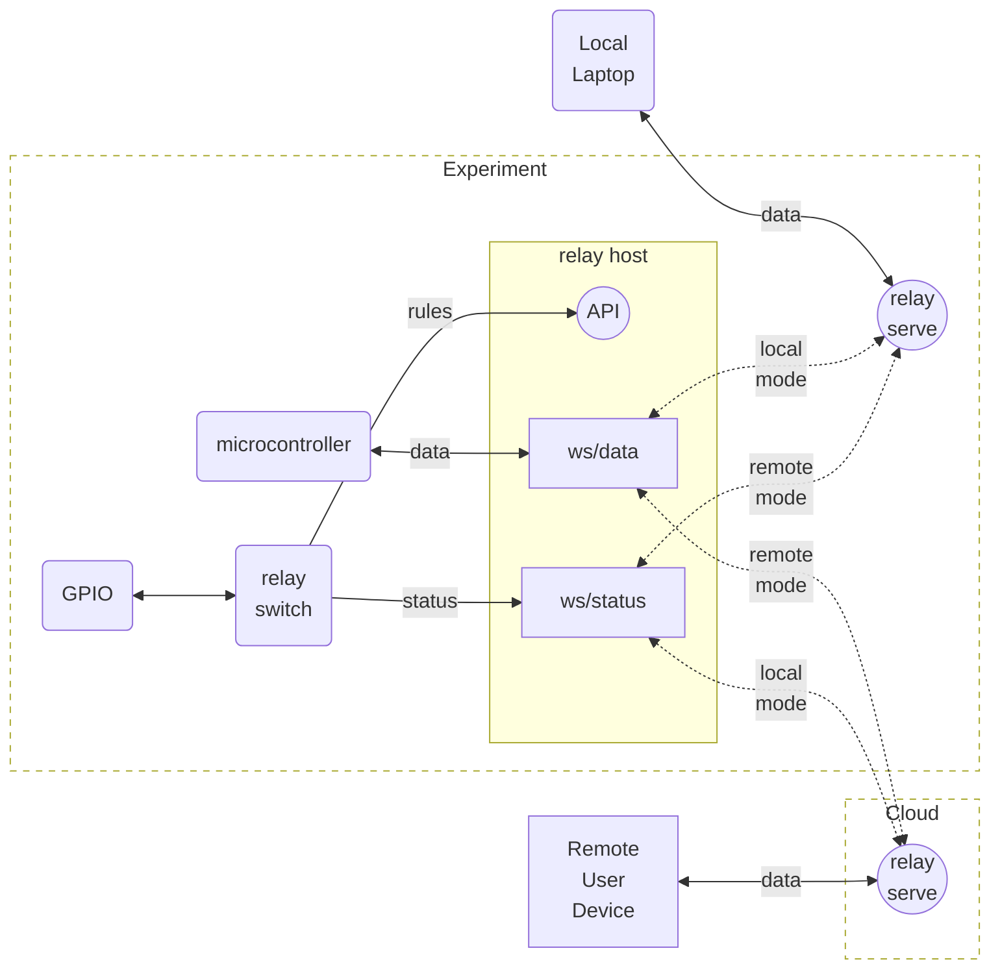

# Relay

![alt_text][logo]

![alt text][status]

Relay is secure, real-time websocket relay that connects users with video and data streams from remote experiments.

 - real-time latency
 - compiled golang code for low computational overhead (low cost)
 - secured with JWT tokens
 - connections can be cancelled (deny list)
 - configurable permissions for read and/or write on each connection 
 - no need to open firewall ports, or get public IPv4 addresses.
 - works with experiments and/or users behind firewalls and NAT because all communications are relayed 
 
 
## Status

The system has been in production since academic year 2020-21, with an upgrade in 2022-2023 to facilite cancellation of sessions.

## Commands

This repo provides a command `relay` comprising a sub-command for each part of the system: 

0. `host` runs on the experiment to connect to the `relay` server instance to stream data and receive commands
0. `relay` runs in the cloud to connect experiments and users.
0. `token` provides tokens for use with the system
0. `file` runs on a client to facilitate testing and maintenance connections
0. `switch` runs on a client to change relay host rules in response to GPIO

## Browser clients

Browsers simply connect via a fetch call to the access point, then opening a websocket to the provided address. We provide [demo code](https://github.com/practable/relay-demojs), with the [key lines](https://github.com/practable/relay-demojs/blob/main/source/src/components/DisplayData.ts#L27) being:

```javascript
methods: {
    getWebsocketConnection() {
      var accessURL = this.stream.url;
      var token = this.stream.token;
      var store = this.$store;
      store.commit("deleteDataURL");
      axios
        .post(accessURL, {}, { headers: { Authorization: token } })
        .then((response) => {
          store.commit("setDataURL", response.data.uri);
        })
        .catch((err) => console.log(err));
    },
  },
```
Then this URL is passed to a component that opens a websocket connection to send, receive messages [here](https://github.com/practable/relay-demojs/blob/main/source/src/components/DataElement.js#L29)

```
this.connection = new WebSocket(this.url); 
```

`this.url` is the `DataURL` obtained in the previous step, passed in as a prop to this separate component.

## Experiment configuration

To see how to use relay in an experiment, check out our experiments (we use bash scripts to generate configuration files and ansible to install them)

[pvna](https://github.com/practable/pocket-vna-two-port/tree/main/sbc)
[spinner-amax](https://github.com/practable/spinner-amax/tree/main/sbc)
[penduino](https://github.com/practable/penduino/tree/main/sbc)


## System design

Websocket connections cannot be secured by tokens sent in the headers, and it is not desirable to send the tokens in plain text in the only other place they could go (query param). So we send the authorisation token securely in the header, to an HTTPS access point, which returns a websocket url including a code in the query param. The code is one-time use only, thus securing the websocket connection with the original token, without revealing it.

<figure>

<figcaption align = "center"><b>Dataflow diagram of the `host` to `relay` connection, reproduced from [1] under CC-BY-4.0 license</b></figcaption>
</figure>

## Status client

The status client `pkg/status` is useful for obtaining status information from another golang service, as per the example below from [status](https://github.com/practable/status).
```
import (	
   rc "github.com/practable/relay/pkg/status"
)

<snip>
    iat := time.Now()
    nbf := time.Now()
    exp := time.Now().Add(s.Config.ReconnectRelayEvery)
    log.WithFields(log.Fields{"iat": iat, "nbf": nbf, "exp": exp}).Trace("Token times")
    aud := s.Config.SchemeRelay + "://" + path.Join(s.Config.HostRelay, s.Config.BasepathRelay)
    bid := "status-server"
    connectionType := "session"
    scopes := []string{"read"}
    topic := "stats"
    token, err := token.New(iat, nbf, exp, scopes, aud, bid, connectionType, s.Config.SecretRelay, topic)
    log.Tracef("token: [%s]", token)
    if err != nil {
    	log.WithField("error", err.Error()).Error("Relay stats token generation failed")
    	time.Sleep(5 * time.Second) //rate-limit retries if there is a long standing issue
    	break
    }
    ctxStats, cancel := context.WithTimeout(ctx, s.Config.ReconnectRelayEvery)
    to := aud + "/" + connectionType + "/" + topic
    log.Tracef("to: [%s]", to)
    r.Connect(ctxStats, to, token)
    cancel() // call to save leaking, even though cancelled before getting to here
<.snip>

```

It can be mocked in testing by eliminating the call to connect to, and just passing populated `[]Report{}` to the `Status` channel. 

```
s := New()

go func() {
	s.Status <- []Report{Report{Topic: "test00"}}
}()

mockReport := <-s.Status:

```
### Switch


We only have one network port on the SBC, so connecting a local laptop needs to be done over a USB connection instead. Few laptops come with a network port anyway. There are various network-over-usb protocols, however it appears that windows uses a different one to linux so it might not be possible to do a direct USB connection from a linux SBC to a windows laptop. Instead, we can put a USB-network adapter port at each end of short network cable, and install that between the SBC and the USB socket for the laptop. That might seem a bit clunky, but it would avoid a protocol mismatch and also it keeps the adapters safely hidden away inside the experiment. 

laptop with USB A socket -> usb cable -> usb-B socket (external) to usb-A socket (internal) -> USB-to-network adapter -> network cable -> network-to-USB adapter -> USB-A socket on SBC





## History

Two other key elements of our system used to be contained in this repo, but now have their own:

[jump](https://github.com/practable/jump) - ssh connection relay service
[book](https://github.com/practable/book) - advance booking of experiments

## References

[1] David P. Reid, Joshua Burridge, David B. Lowe, and Timothy D. Drysdale (corresponding author), Open-source remote laboratory experiments for controls engineering education, International Journal of Mechanical Engineering Education, Accepted 22 Jan 2022. 


[status]: https://img.shields.io/badge/status-production-green "status; production"
[logo]: ./img/logo.png "Relay ecosystem logo - hexagons connected in a network to a letter R"


