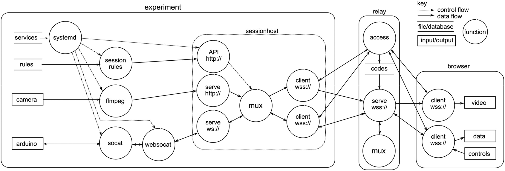

# SESSION

The session command provides three main sub-commands:

- `host`
- relay (two parts, `access` and `relay`)
- `client`

An introduction to the system is [here](https://doi.org/10.1177/03064190221081451). A dataflow diagram from that paper is reproduced here (omitting `client` in favour of the more usual browser endpointon the client side):



The three commands are described below, but first some background.

## Background

Sending MPEGTS streams over websockets is attractive for remote laboratory experiments because they often cannot have public IP addresses, and must sit behind restrictive firewalls that often permit only outgoing ```80/tcp``` and ```443/tcp```. Therefore these experiments cannot act as servers, and must instead rely on a remote relay that can receive their websocket video stream and arrange for it to be forwarded to a user. That remote relay must be readily changeable in order to facilitate cost savings like using short-lived spot-priced servers or for coping with other remote relay failures. In some cases, the reconfigurability is required within the experiment, for cost and privacy reasons. The MPEGTS streams can be comprised of separately-encoded video and audio tracks, perhaps of selectable bitrate for bandwidth efficiency. For privacy reasons, it is desirable to be able add and subtract individual tracks from the outgoing stream, for example to facilitate a room-wide mute function across multiple experiments when humans are present. This is particularly important for beginning hosters who are using their offices or homes for experiments, but don't want to entirely disable the audio (but just mute it when they are present). Obviously, the existing [phoboslab/jsmpeg](https://github.com/phoboslabs/msjpeg) relay could be made configurable with a config file, and simply restarted as needed. Since there is a delay to starting ffmpeg, it would instead be preferable to hot-swap the destination with a dynamically reconfigurable local relay so that the video connection can be maintained without a 1-sec outage due to ffmpeg restarting. This then requires the local relay to run continuously, and if the destination must be updated because the remote relay has changed, or the audio mute has been toggled, then the local relay must be dynamically reconfigurable. This also happens to resonate with the 12-factor approach of avoiding configuration files in favour of a RESTful API for configuration. Also, for sustainability, it is attractive to consider switching videos on and off to save streaming if not needed. This approach also provides the building blocks for such a system, such as a way to send the messaging to coordinate when to stream the video, via commands send over a separate data channel to the rules API.

### Related projects
Related ```golang``` projects include [ws-tcp-relay](https://github.com/isobit/ws-tcp-relay) which calls itself [websocketd](https://github.com/joewalnes/websocketd) for TCP instead of ```STDIN``` and ```STDOUT```. Note that [ws-tcp-relay](https://github.com/isobit/ws-tcp-relay) has a websocket server, not a client as required here.

## Getting started

Download and build in the usual manner, then drop into a place on your path.

    $ go get github.com/practable/relay
	$ cd relay
	$ go mod tidy
	$ cd cmd/session
	$ go build
	$ cp ./session /usr/local/bin

## RELAY

The relay needs to run on a publically-facing server with a proxy that terminates the incoming ssl terminations. There are two parts to the relay service, so as to ensure that websocket connections can be set up securely. Initial contact is made to an 


The relevant snippet from my `nginx.conf` is:

```
server {
        listen      443 ssl;
        server_name relay-access.practable.io;
        root /var/www/relay-access.practable.io;
    
       	ssl_certificate /etc/ssl/practable.io.crt;
       	ssl_certificate_key /etc/ssl/practable.io.key;
    
        location / {

            if ($request_method = 'OPTIONS') {
              add_header 'Access-Control-Allow-Origin' '*';
              add_header 'Access-Control-Allow-Credentials' 'true';
              add_header 'Access-Control-Allow-Methods' 'GET, POST, OPTIONS';
              add_header 'Access-Control-Allow-Headers' 'Authorization,DNT,X-CustomHeader,Keep-Alive,User-Agent,X-Requested-With,If-Modified-Since,Cache-Control,Content-Type';
              add_header 'Access-Control-Max-Age' 86400;
              add_header 'Content-Type' 'text/plain charset=UTF-8';
              add_header 'Content-Length' 0;
              return 204; break;
           }
           if ($request_method = 'DELETE') {
              add_header 'Access-Control-Allow-Origin' '*';
              add_header 'Access-Control-Allow-Credentials' 'true';
              add_header 'Access-Control-Allow-Methods' 'GET, POST, OPTIONS';
              add_header 'Access-Control-Allow-Headers' 'Authorization,DNT,X-CustomHeader,Keep-Alive,User-Agent,X-Requested-With,If-Modified-Since,Cache-Control,Content-Type';
           }    
           if ($request_method = 'GET') {
              add_header 'Access-Control-Allow-Origin' '*';
              add_header 'Access-Control-Allow-Credentials' 'true';
              add_header 'Access-Control-Allow-Methods' 'GET, POST, OPTIONS';
              add_header 'Access-Control-Allow-Headers' 'Authorization,DNT,X-CustomHeader,Keep-Alive,User-Agent,X-Requested-With,If-Modified-Since,Cache-Control,Content-Type';
           }
		   if ($request_method = 'POST') {
              add_header 'Access-Control-Allow-Origin' '*';
              add_header 'Access-Control-Allow-Credentials' 'true';
              add_header 'Access-Control-Allow-Methods' 'GET, POST, OPTIONS';
              add_header 'Access-Control-Allow-Headers' 'Authorization,DNT,X-CustomHeader,Keep-Alive,User-Agent,X-Requested-With,If-Modified-Since,Cache-Control,Content-Type';
           }
           if ($request_method = 'PUT') {
              add_header 'Access-Control-Allow-Origin' '*';
              add_header 'Access-Control-Allow-Credentials' 'true';
              add_header 'Access-Control-Allow-Methods' 'GET, POST, OPTIONS';
              add_header 'Access-Control-Allow-Headers' 'Authorization,DNT,X-CustomHeader,Keep-Alive,User-Agent,X-Requested-With,If-Modified-Since,Cache-Control,Content-Type';
           }		   
		   
            proxy_pass          http://localhost:3000;
            proxy_http_version 1.1;
            proxy_set_header    Host             $host;
            proxy_set_header    X-Real-IP        $remote_addr;
            proxy_set_header    X-Forwarded-For  $proxy_add_x_forwarded_for;
            proxy_read_timeout 1800;
            proxy_connect_timeout 1800;
        }
   	

    }
    
   server {
        listen 443 ssl;
        server_name relay.practable.io;
    
        ssl_certificate /etc/ssl/practable.io.crt;
        ssl_certificate_key /etc/ssl/practable.io.key;
    
    	location / {
    	    proxy_http_version 1.1;
    	    proxy_set_header Upgrade $http_upgrade;
            proxy_set_header Connection "upgrade";
    	    proxy_set_header X-Forwarded-For $proxy_add_x_forwarded_for;
    	    proxy_pass http://localhost:3001;
    	}
    }
```

The relay is set up to listen on port 3001 internally. This should not be externally accessible, for security reasons, so all connections are via the nginx proxy.
`session.service`
```
[Unit]
Description=github.com/relay session
After=network.target

[Service]
Environment=RELAY_ACCESSPORT=3000
Environment=RELAY_ACCESSFQDN=https://relay-access.practable.io
Environment=RELAY_RELAYPORT=3001
Environment=RELAY_RELAYFQDN=wss://relay.practable.io
Environment=RELAY_SECRET=<your secret goes here>
Environment=RELAY_DEVELOPMENT=true

Type=simple
Restart=always
ExecStart=/usr/local/bin/session relay

PermissionsStartOnly=true
ExecStartPre=/bin/mkdir -p /var/log/relay
ExecStartPre=/bin/chown syslog:adm /var/log/relay
ExecStartPre=/bin/chmod 755 /var/log/relay
StandardOutput=syslog
StandardError=syslog
SyslogIdentifier=session

[Install]
WantedBy=multi-user.target
```

## TOKEN

For the host and client to access the relay, they will need tokens.

You can put your secret outside of the repo on a secure machine, e.g in 
`$HOME/secret/session_secret.sh`
```
echo <your secret goes here>
```

Then you can call that script to give your access token, without accidentally 
committing that token to your management repo (putting a pre-commit hook to 
check for tokens is useful step too, but outside the scope of this doc).

`session_token.sh`
```
export ACCESSTOKEN_LIFETIME=$1
export ACCESSTOKEN_ROLE=client
export ACCESSTOKEN_SECRET=$($HOME/secret/session_secret.sh)
export ACCESSTOKEN_TOPIC=$2
export ACCESSTOKEN_CONNECTIONTYPE=session
export ACCESSTOKEN_AUDIENCE=https://relay-access.practable.io
export SESSION_TOKEN=$(session token)
echo $SESSION_TOKEN
```

## HOST	

This is usually run with the default settings as a service on your experiment's host (we use Raspberry Pi 4 successfully):

    $ session host

An example linux service file is as follows:

`session.service`
```
[Unit]
Description=session host streaming service
After=network.target
[Service]
Restart=on-failure
ExecStart=/usr/local/bin/session host

[Install]
WantedBy=multi-user.target session-rules.service
```

It listens on port 8888. Use the `ts` route for video, and `ws` for bi-directional data. 

You simply need to stream your video(s) to the `ts` routing host on port, choosing a routing that is distinct for each one (we'll reference these later though):

```
$ ffmpeg -f v4l2 -framerate 25 -video_size 640x480 -i /dev/video0 -f mpegts -codec:v mpeg1video -s 640x480 -b:v 1000k -bf 0 http://localhost:8888/ts/video0
```


## HTTP/JSON API

The API allows rules to be added, deleted, and listed.

### Rules for feeds and Streams

```feeds``` are individual tracks from ffmpeg, which can be forwarded by using a single destination rule:
	
    $ curl -X POST -H "Content-Type: application/json" -d '{"stream":"video0","destination":"wss://<some.relay.server>/in/video0","id":"0"}' http://localhost:8888/api/destinations 

```streams``` can combine multiple tracks (typically one video and one audio track are all that a player can handle), and require both a stream rule and a destination rule. Streams are prefixed with a mandatory ```stream/``` - note that if you supply a leading '/' then you will not be able to delete the stream because you cannot access an endpoint with '//' in it.

    $ curl -X POST -H "Content-Type: application/json" -d '{"stream":"/stream/front/large","feeds":["video0","audio0"]}' http://localhost:8888/api/streams
	$ curl -X POST -H "Content-Type: application/json" -d '{"stream":"/stream/front/large","destination":"wss://<some.relay.server>/in/video0","id":"0"}' http://localhost:8888/api/destinations

### Updating rules

Existing rules can be updated by simply adding them again, e.g. to mute the audio:

    $ curl -X POST -H "Content-Type: application/json" -d '{"stream":"/stream/front/large","feeds":["video0"]}' http://localhost:8888/api/streams

 or to change the destination (note the rule ```id``` is kept the same):

	$ curl -X POST -H "Content-Type: application/json" -d '{"stream":"/stream/front/large","destination":"wss://<some.relay.server>/in/video1","id":"0"}' http://localhost:8888/api/destinations

### Seeing existing rules

If you want to see the ```streams``` you have set up:
   
    $ curl -X GET http://localhost:8888/api/streams/all
     {"stream/front/large":["video0","audio0"]}	 

If you want to see the ```destinations``` you have set up:

    $ curl -X GET http://localhost:8888/api/destinations/all
	  {"0":{"id":"0","stream":"stream/front/large","destination":"wss://video.practable.io:443/in/video2"}}

### Deleting individual rules
   
If you want to delete a ```stream``` (response confirms which stream was deleted):

    $ curl -X DELETE http://localhost:8888/api/streams/stream/front/large
     "stream/front/large"

If you want to delete a ```destination``` then refer to its ```id``` (response confirms which ```id``` was deleted)

    $ curl -X DELETE http://localhost:8888/api/destinations/0
      "0"

### Deleting all rules

Simply use the <>/all endpoint, e.g. 

    $ curl -X DELETE http://localhost:8888/api/streams/all

or

    $ curl -X DELETE http://localhost:8888/api/destinations/all


## WS/JSON API

For external control over the destinations, it may in some cases be simpler to use VW's JSON api, but this requires care to be paid to securing the endpoint destination you assign to your apiRule, which should use a bidirectional data relay.

To start VW and automatically connect the API to an endpoint (must be bidirectional, i.e. ```/bi/...```), set environment variable `VW_API`, e.g.
```
export VW_API=wss://some.relay.server:443/bi/some/where/unique
vw stream
```

Then connect to your VW instance from another machine with a websocket client. For demonstration purposes, you can connect using ```websocat``` and type commands interactively.

``` 
websocat - wss://some.relay.server:443/bi/some/where/unique
```

The commands are slightly more consistent than the REST-ish API.
```
-> {"verb":"healthcheck"}
<- {"healthcheck":"ok"}
```

Adding streams and destinations:
```
-> {"verb":"add","what":"destination","rule":{"stream":"video0","destination":"wss://some.relay.server/in/video0","id":"0"}}
<- {"id":"0","stream":"video0","destination":"wss://some.relay.server/in/video0"}

-> {"verb":"add","what":"stream","rule":{"stream":"video0","feeds":["video0","audio0"]}}
<- {"stream":"video0","feeds":["video0","audio0"]}
```

Listing what you have individually:

```
-> {"verb":"list","what":"stream","which":"video0"}
<- {"feeds":["video0","audio0"]}

-> {"verb":"list","what":"stream","which":"doesnotexist"}
<- {"feeds":null}

-> {"verb":"list","what":"destination","which":"0"}
<- {"id":"0","stream":"video0","destination":"wss://some.relay.server/in/video0"}
```

or everything ...
```
-> {"verb":"list","what":"stream","which":"all"}
<- {"video0":["video0","audio0"]}
   
-> {"verb":"list","what":"destination","which":"all"}
<- {"0":{"id":"0","stream":"video0","destination":"wss://some.relay.server/in/video0"},"apiRule":{"id":"apiRule","stream":"api","destination":"wss://some.relay.server:443/bi/some/where/unique"}}
```

Deleting streams and destinations individually:
```
-> {"verb":"delete","what":"stream","which":"video0"}
<- {"deleted":"video0"}
   
-> {"verb":"delete","what":"destination","which":"0"}
<- {"deleted":"0"}
```

or deleting all streams (note that the response is deleteAll, to confirm that "all" was treated specially:
```
<- {"verb":"delete","what":"stream","which":"all"}
<- {"deleted":"deleteAll"}
```

### Footguns

Only minimal footgun avoidance is included. 

- You cannot delete the apiRule from the WS/JSON API 

```
-> {"verb":"delete","what":"destination","which":"apiRule"}
<- {"error":"Cannot delete apiRule"}
```
- Issuing delete all destinations from the WS/JSON API does indeed delete all rules, but the apiRule is immediately re-instated

```   
-> {"verb":"delete","what":"destination","which":"all"}
(no response because it disconnected itself, then reconnected)
```

- Deletes issued via the HTTP/JSON API do NOT have these protections - but since you can access that API too, you can reinstate as you please
- You can modify the apiRule, which will cause an immediate disconnect. The new destination needs to be working or else you
will be locked out, as it were

- Bad commands just throw an error

```
-> Not even JSON
<- {"error":"Unrecognised Command"}
```

## Identifying your devices

### Cameras

You can find the cameras attached to your system with ```v4l2-ctl```:

	$ v4l2-ctl --list-devices

Since ```/dev/video<N>``` designations can change from reboot to reboot, for production, it is better to configure using the serial number, such as 

	  /dev/v4l/by-id/usb-046d_Logitech_BRIO_nnnnnnnn-video-index0

If your camera needs to be initialised or otherwise set up, e.g. by using ```v4l2-ctl``` to specify a resolution or pixel format, then you may find it helpful to write a shell script that takes the dynamically generated endpoint as an argument. For example (not tested, TODO test), your script ```fmv.sh``` for producing medium-size video using ```ffmpeg``` might contain:

    #!/bin/bash
    v4l2-ctl --device $1 --set-fmt-video=width=640,height=480,pixelformat=YUYV
    ffmpeg -f v4l2 -framerate 25 -video_size 640x480 -i $1 -f mpegts -codec:v mpeg1video -s 640x480 -b:v 1000k -bf 0 $2

### Resetting from command line

On linux (tested on Ubuntu) you can [deauthorize and reauthorize usb devices from the CLI](https://askubuntu.com/questions/645/how-do-you-reset-a-usb-device-from-the-command-line)

```
sudo sh -c "echo 0 > /sys/bus/usb/devices/1-5/authorized"
sudo sh -c "echo 1 > /sys/bus/usb/devices/1-5/authorized"
```
You can find the right path by looking in dmesg

### Raspberry pi

From [jsmpeg README](https://github.com/phoboslab/jsmpeg)
> This example assumes that your webcam is compatible with Video4Linux2 and appears as /dev/video0 in the filesystem. Most USB webcams support the UVC standard and should work just fine. The onboard Raspberry Camera can be made available as V4L2 device by loading a kernel module: sudo modprobe bcm2835-v4l2.

### Microphones

Use you can use this command on linux:

    $ arecord -l

TODO: This command is not currently known to work (but a previous version of the command I don't have to hand, did work)

    $ ffmpeg -f alsa -i hw:2 -filter:a "volume=50" -f mpegts -codec:a libmp3lame -b:a 24k http://localhost:8888/ts/audio0

Things can get a bit more tricky if you are using ```ffmpeg``` within a docker container, because you need to pass the device and network to the container and you also need to have ```sudo``` permissions in some implementations. There's a description of using alsa and pulseaudio with docker [here](https://github.com/mviereck/x11docker/wiki/Container-sound:-ALSA-or-Pulseaudio).

## Platform specific comments 

#### Linux

Developed and tested on Centos 7 for x86_64, Kernel version 3.10, using ```v4l2```, ```alsa``` and ```ffmpeg```

#### Windows 10

I managed to compile and run an earlier version of the code, but I had issues trying to get ```dshow``` to work with my logitech c920 camera and ```ffmpeg```, so I am deferring further testing until windows-hosted experiments become a higher priority.

#### aarch64

```vw``` has been successfully cross-compiled and used with the aarch64 ARM achitecture of the Odroid N2, running an Ubuntu 18.04.2 LTS flavour linux with kernel version 4.9.1622-22.

		 $ export GOOS = linux
		 $ export GOARCH = arm64
		 $ go build


## Testing

A write-to-file feature was added to destination rules, to record outgoing messages without any extra newlines or any indication of message boundaries. This allows the stream to be analysed to check for errors in the way that ```vw``` is handling the MPEG TS stream. Currently this is a manual test, passing.

```
curl -X POST -H "Content-Type: application/json" -d '{"stream":"video","destination":"wss://relay.somewhere.io/in/video","id":"0","file":"video.ts"}' http://localhost:8888/api/destinations

ffmpeg -f v4l2 -framerate 24 -video_size 640x480 -i /dev/video0 -f mpegts -codec:v mpeg1video -s 640x480 -b:v 1000k -bf 0 http://127.0.0.1:8888/ts/video
```


```
$ tsananlyze video.ts
===============================================================================
|  TRANSPORT STREAM ANALYSIS REPORT                                           |
|=============================================================================|
|  Transport Stream Id: .......... 1 (0x0001)  |  Services: .............. 1  |
|  Bytes: ........................ 44,234,332  |  PID's: Total: .......... 4  |
|  TS packets: ...................... 235,289  |         Clear: .......... 4  |
|     With invalid sync: .................. 0  |         Scrambled: ...... 0  |
|     With transport error: ............... 0  |         With PCR's: ..... 1  |
|     Suspect and ignored: ................ 0  |         Unreferenced: ... 0  |
|-----------------------------------------------------------------------------|
|  Transport stream bitrate, based on ....... 188 bytes/pkt    204 bytes/pkt  |
|  User-specified: ................................... None             None  |
|  Estimated based on PCR's: ................ 1,109,025 b/s    1,203,410 b/s  |
|-----------------------------------------------------------------------------|
|  Broadcast time: .................................. 319 sec (5 min 19 sec)  |
|-----------------------------------------------------------------------------|
|  Srv Id  Service Name                              Access          Bitrate  |
|  0x0001  Service01 .................................... C    1,076,115 b/s  |
|                                                                             |
|  Note 1: C=Clear, S=Scrambled                                               |
|  Note 2: Unless specified otherwise, bitrates are based on 188 bytes/pkt    |
===============================================================================

```

There are no invalid sync, transport error or suspect-and-ignored packets, so this stream is in good condition.

## CLIENT

Client is a utility to help with logging and checking experiments using cron.

### FILE

#### PREQUISITES

If you are connecting to a session relay, then you will need a JWT token 
that is valid for the relay you are connecting to. This
will probably be supplied by the administrator of the relay (using some
commands similar to this example:

```bash
export ACCESSTOKEN_LIFETIME=86400
export ACCESSTOKEN_ROLE=client
export ACCESSTOKEN_SECRET=$($HOME/secret/session_secret.sh)
export ACCESSTOKEN_TOPIC=spin35-data
export ACCESSTOKEN_CONNECTIONTYPE=session
export ACCESSTOKEN_AUDIENCE=https://relay-access.practable.io
export SESSION_CLIENT_TOKEN=$(session token)
```

#### MODES OF OPERATION

Session client file supports three main modes of operation. For all of them, you can see 
addition logging information to stdout by setting development mode. This might be useful
while building familiarity with the tool. It does not show the content of incoming messages
but reports their size.
```bash
export SESSION_CLIENT_FILE_DEVELOPMENT=true
```

##### LOG 

You must specify a session to connect to, and a file to log to
```bash
export SESSION_CLIENT_SESSION=$ACCESSTOKEN_AUDIENCE/$ACCESSTOKEN_CONNECTIONTYPE/$ACCESSTOKEN_TOPIC
export SESSION_CLIENT_FILE_LOG=/var/log/session/spin35-data.log
session client file
```

##### PLAY

You can optionally also log any messages you get back, useful for running equipment checks.

```bash
export SESSION_CLIENT_SESSION=$ACCESSTOKEN_AUDIENCE/$ACCESSTOKEN_CONNECTIONTYPE/$ACCESSTOKEN_TOPIC
export SESSION_CLIENT_FILE_LOG=/var/log/session/spin35-data.log
export SESSION_CLIENT_FILE_PLAY=/etc/practable/spin35-check.play
session client file
```

If you are sending messages that with a short timeout, or a very 
long timeout, on conditions, then you 
may wish to specify a custom timeout interval (default is 1s)
```bash
export SESSION_CLIENT_FILE_INTERVAL=10ms
```

If your play file has errors but you want to play it anyway, then 
```bash
export SESSION_CLIENT_FILE_FORCE=true
```

More information on the play file format is given below.

##### CHECK

If you just want to check the syntax in your playfile, without 
connecting to a relay, you can check it with

export SESSION_CLIENT_FILE_CHECK_ONLY=true
export SESSION_CLIENT_FILE_PLAY=/etc/practable/spin35-check.play
session client file


#### PLAYFILE FORMAT

The playfile lets you specify messages to send, as well as control
when they are sent, either by specifying delays, or messages to 
await reception of. You can also control which messages are logged
to file, by setting filters. Note that logging ends when the playfile
has finished, so if setting the filter for a long term logging session
make sure you add a final wait command with a long duration, longer
than you plan to log for (e.g. you might set this to 8760h for one year.

##### DURATIONS

A duration string is an unsigned decimal number with optional fraction 
and a mandatory unit suffix, such as "300ms", "1.5h" or "2m45s". 
Valid time units are "ms", "s", "m", "h".

##### COMMANDS

The format of the play file is one message per line. Each line can 
have one command. The available commands are:

- comment
- wait
- send/now
- send/delay
- send/condition
- filter setting

##### EXAMPLES

Some example lines to show what is possible include:

```
# comment
#+ comment that is echoed to log file
# send/now
{"some":"msg"}
# send/delay
[1.2s] {"some":"msg"}
# send command after receiving sufficient messages matching a pattern, or timing out
# collect 5 "is running" messages, or wait 10s, whichever comes first, then send message
<'\"is\"\s*:\s*\"running\"',5,10s> {"stop":"motor"}
# wait for 100ms, without sending a message
[100ms]
# Add an accept filter
|+> ^\s*{
# Add a deny filter
|-> "hb"
# reset the filter to pass everything
|r>
```

##### COMMENTS

Comments come in three formats

```
# non-echo
#- non-echo (just more explicit)
#+ echo to log file (not sent to relay, helpful for delimiting tests)
```

Any line starting with # is ignored as a comment. If you want to send
a message starting with # then you simply need to prepend a delay, e.g.

```
# This won't be sent because it is a comment
[] # This WILL be sent (not that I'd recommend it)
```

##### WAIT 

If you specify a duration in square brackets on its own, no message
is sent, but playback pauses for the duration specified. E.g. pause
for two seconds:

```
[2s]
```

###### SEND/NOW

Any message that is not of a defined type, is considered a message 
to be sent right away, e.g. 

```
{"some":"message"}
set foo=bar
```

Your message format doesn't have to be JSON

###### SEND/DELAY

Each line can be prepended by an optional delay within square brackets, e.g.
```
[0.1s] {"some":"msg"}
```

A regular expression is used to separate the optional delay from 
the message, such that the message transmitted starts with the 
first non-white space character occuring after the delay. There are
no further assumptions made about the message format, so as to 
support testing with malformed JSON or other message formats as may
be required to interact with hardware or utilities attached to 
session hosts. 
Therefore it is only possible to send a message consisting of only
whitespace, if you omit the delay. Such a message may be 
useful for testing the rejection of non-messages, where the lack of
a delay is less likely to be relevant.

For readability, it may be useful to pad the delay value inside the
brackets with whitespace. It is also acceptable to have a zero delay, 
or an empty delay (for no delay)
```
[] valid, zero delay
[0s] valid, zero delay
[  10ms ] valid, delay of 10ms
[ 0.1s ] valid, delay of 100ms
```
It is not recommended to specify delays of less than one millisecond 
(0.001) because these are unlikely to be faithfully respected. Note
that all delays are simply that - an additional delay on top of any
overhead already incurred in sending the previous message. They 
should not be treated as accurate inter-message spacings.

##### SEND/CONDITION

These are intended to speed up scripts that are waiting for some
sort of variable duration task, like collecting a certain number
of results, or waiting for a calibration to finish. There is no
conditional processing of outputs i.e. there is no scripting 
available. If you require complicated behaviours, then you should 
consider making a direct connection to the relay from a tool you've 
written in your favourite method. 

Since there is no conditional processing, if the condition is not
met, then it times out, and the command is sent anyway. The format 
of the conditional is 
 
```
<'REGEXP',COUNT,TIMEOUT>
```

All arguments are mandatory. Regexp is in golang format, so note that
some lookahead options are not supported (an error will be thrown during 
the check if the regexp does not compile).

Your regexp should be enclosed in single quotes. You can include single 
quotes in your regexp if they are escaped with backslash, e.g. a 
conditional to find 'foo' looks like this:
```
<'\'foo\'',1,10>
```
Of course, if you just want to look for foo, that's simpler:
```
<'foo',1,10>
```
#### LOG ROTATION

If you are using logrotate(8), then send SIGHUP in your postscript. 
Do NOT restart the service, as you will lose any messages sent during 
the brief window that access is renegotiated (typically fast, but 
theoretically you could miss a message).

See [log-only.sh](github.com/practable/relay/scripts/examples/session_client/log-only.sh) for a
demonstration of log rotation using sighup, which goes a bit like this:

```
# environment variable setup omitted for brevity
session client file
export pid=$!
mv $logfile $logfile1
kill -SIGHUP pid
```
